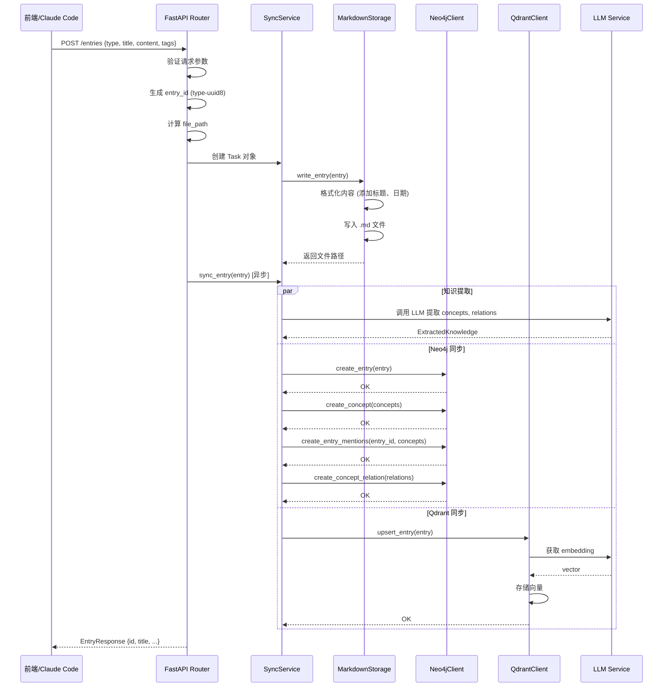
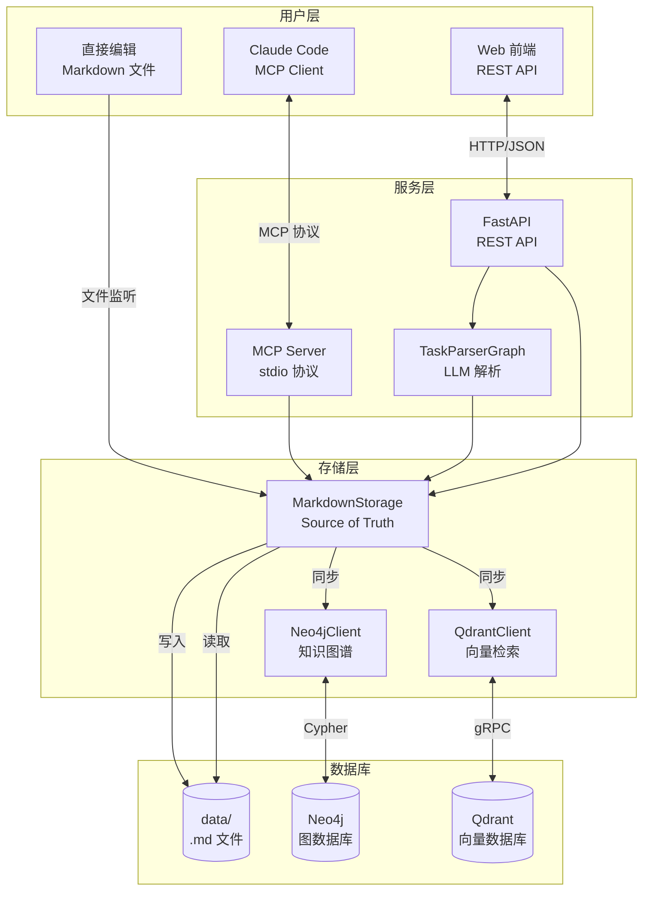
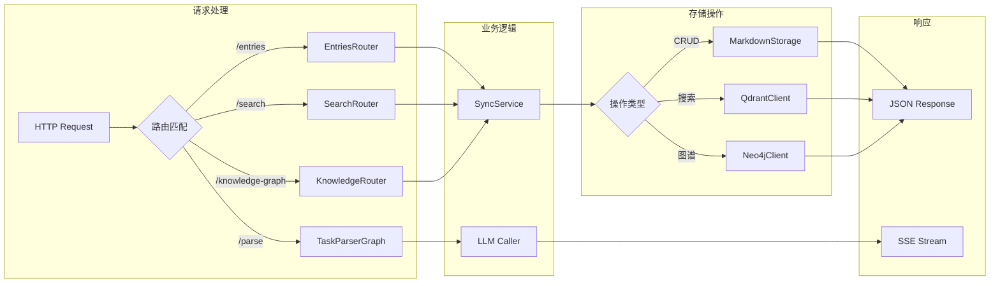
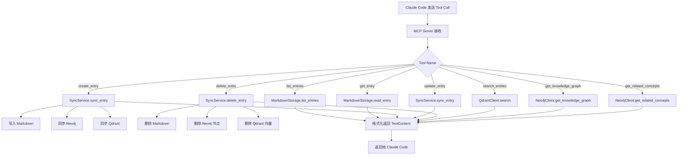
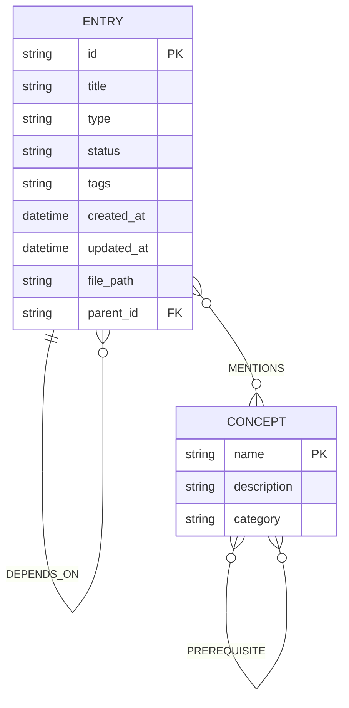
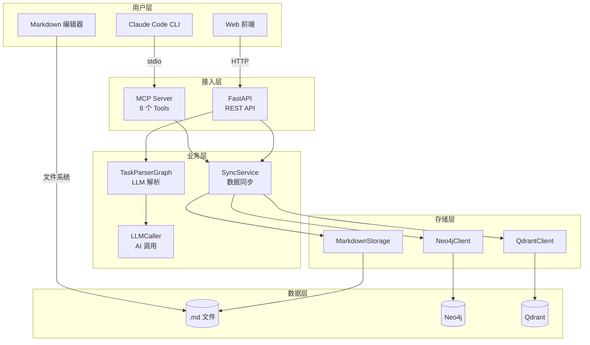

# 个人成长助手 - 后端架构设计

> 最后更新：2026-03-16

---

## 1. 类图 (Class Diagram)

```mermaid
classDiagram
    %% 数据模型
    class Category {
        <<enumeration>>
        PROJECT
        TASK
        NOTE
        INBOX
    }

    class TaskStatus {
        <<enumeration>>
        WAIT_START
        DOING
        COMPLETE
    }

    class Task {
        +str id
        +str title
        +str content
        +Category category
        +TaskStatus status
        +List~str~ tags
        +datetime created_at
        +datetime updated_at
        +datetime planned_date
        +datetime completed_at
        +int time_spent
        +str parent_id
        +str file_path
    }

    class Concept {
        +str name
        +str description
        +str category
    }

    class ConceptRelation {
        +str from_concept
        +str to_concept
        +str relation_type
    }

    class ExtractedKnowledge {
        +List~str~ tags
        +List~Concept~ concepts
        +List~ConceptRelation~ relations
    }

    Task --> Category
    Task --> TaskStatus

    %% 存储层
    class MarkdownStorage {
        -Path data_dir
        +read_entry(entry_id, category) Task
        +write_entry(entry) str
        +delete_entry(entry_id, category) bool
        +list_entries(category, status, limit) List~Task~
        +scan_all() List~Task~
        -_extract_title(content) str
        -_extract_tags(content) List~str~
        -_extract_created_at(content, file_path) datetime
    }

    class Neo4jClient {
        -str uri
        -str username
        -str password
        -AsyncDriver _driver
        +connect()
        +close()
        +create_entry(entry) bool
        +update_entry(entry) bool
        +delete_entry(entry_id) bool
        +get_entry(entry_id) Dict
        +list_entries(type, status, limit) List
        +create_concept(concept) bool
        +create_entry_mentions(entry_id, concepts) bool
        +create_concept_relation(relation) bool
        +get_knowledge_graph(concept, depth) Dict
        +get_related_concepts(concept) List
        +create_indexes()
    }

    class QdrantClient {
        -str url
        -str api_key
        -AsyncQdrantClient _client
        -embedding_func
        +connect()
        +close()
        +upsert_entry(entry) bool
        +delete_entry(entry_id) bool
        +get_entry(entry_id) Dict
        +search(query, limit, filters) List
        +batch_upsert(entries) int
        +get_stats() Dict
    }

    class SyncService {
        +MarkdownStorage markdown
        +Neo4jClient neo4j
        +QdrantClient qdrant
        +llm_caller
        +sync_entry(entry) bool
        +delete_entry(entry_id) bool
        +sync_all() Dict
        +resync_entry(entry_id) bool
        -_extract_knowledge(entry) ExtractedKnowledge
        -_extract_with_llm(entry) ExtractedKnowledge
        -_extract_with_rules(entry) ExtractedKnowledge
    }

    SyncService --> MarkdownStorage
    SyncService --> Neo4jClient
    SyncService --> QdrantClient

    %% API 路由层
    class EntriesRouter {
        +list_entries(type, status, limit) EntryListResponse
        +get_entry(entry_id) EntryResponse
        +create_entry(request) EntryResponse
        +update_entry(entry_id, request) SuccessResponse
        +delete_entry(entry_id) SuccessResponse
    }

    class SearchRouter {
        +search_entries(request) SearchResponse
    }

    class KnowledgeRouter {
        +get_knowledge_graph(concept, depth) KnowledgeGraphResponse
        +get_related_concepts(concept) RelatedConceptsResponse
    }

    %% LLM 调用层
    class LLMCaller {
        <<interface>>
        +call(messages, response_format) str
    }

    class APICaller {
        +call(messages, response_format) str
    }

    class TaskParserGraph {
        +LLMCaller caller
        +AsyncSqliteSaver checkpointer
        +StateGraph graph
        +stream_parse(text, thread_id) AsyncGenerator
        +clear_thread(thread_id)
        -_build_graph()
        -_parse_node(state)
    }

    LLMCaller <|.. APICaller
    TaskParserGraph --> LLMCaller

    %% MCP Server
    class MCPServer {
        +Server server
        +list_tools() List~Tool~
        +call_tool(name, arguments) List~TextContent~
        -handle_list_entries(args)
        -handle_get_entry(args)
        -handle_create_entry(args)
        -handle_update_entry(args)
        -handle_delete_entry(args)
        -handle_search_entries(args)
        -handle_get_knowledge_graph(args)
    }

    MCPServer --> SyncService
```



---

## 2. 创建条目时序图 (Sequence Diagram)



---

## 3. 数据流图 (Data Flow Diagram)



---

## 4. API 请求处理流程图



---

## 5. MCP Tools 调用流程图



---

## 6. 知识图谱数据模型 (ER Diagram)



**字段说明**：
- `ENTRY.type`: project / task / note / inbox
- `ENTRY.status`: waitStart / doing / complete
- `CONCEPT.category`: 技术 / 方法 / 工具

---

## 7. 整体架构图



---

## 项目结构

```
backend/
├── app/
│   ├── main.py                 # FastAPI 入口 + 生命周期管理
│   ├── config.py               # 配置管理
│   ├── models/
│   │   ├── __init__.py
│   │   └── task.py             # Task, Concept, ConceptRelation 模型
│   ├── routers/
│   │   ├── __init__.py         # 导出 routers
│   │   ├── entries.py          # CRUD /entries
│   │   ├── search.py           # POST /search
│   │   └── knowledge.py        # GET /knowledge-graph, /related-concepts
│   ├── storage/
│   │   ├── __init__.py         # 导出 + init_storage()
│   │   ├── markdown.py         # Markdown 文件读写
│   │   ├── neo4j_client.py     # Neo4j 知识图谱操作
│   │   ├── qdrant_client.py    # Qdrant 向量检索
│   │   └── sync.py             # 三层存储同步逻辑
│   ├── mcp/
│   │   ├── __init__.py
│   │   └── server.py           # MCP Server + 8 个 Tools
│   ├── callers/
│   │   ├── __init__.py
│   │   ├── base.py             # LLMCaller 接口
│   │   ├── api_caller.py       # API 调用实现
│   │   └── mock_caller.py      # Mock 实现
│   ├── graphs/
│   │   ├── __init__.py
│   │   └── task_parser_graph.py # LangGraph 任务解析
│   └── services/
│       └── __init__.py
├── data/                       # Markdown 数据目录
│   ├── projects/
│   ├── tasks/
│   ├── notes/
│   └── inbox.md
├── .env                        # 环境变量
└── pyproject.toml              # 依赖配置
```

---

## API 端点列表

| 端点 | 方法 | 说明 |
|------|------|------|
| `/health` | GET | 健康检查 |
| `/parse` | POST | LLM 解析自然语言（SSE 流式） |
| `/session/{id}` | DELETE | 清空会话历史 |
| `/entries` | GET | 列出条目 |
| `/entries` | POST | 创建条目 |
| `/entries/{id}` | GET | 获取条目 |
| `/entries/{id}` | PUT | 更新条目 |
| `/entries/{id}` | DELETE | 删除条目 |
| `/search` | POST | 语义搜索 |
| `/knowledge-graph/{concept}` | GET | 获取知识图谱 |
| `/related-concepts/{concept}` | GET | 获取相关概念 |

---

## MCP Tools 列表

| Tool | 说明 |
|------|------|
| `list_entries` | 查询条目列表 |
| `get_entry` | 获取单个条目 |
| `create_entry` | 创建新条目 |
| `update_entry` | 更新条目 |
| `delete_entry` | 删除条目 |
| `search_entries` | 语义搜索 |
| `get_knowledge_graph` | 获取知识图谱 |
| `get_related_concepts` | 获取相关概念 |
